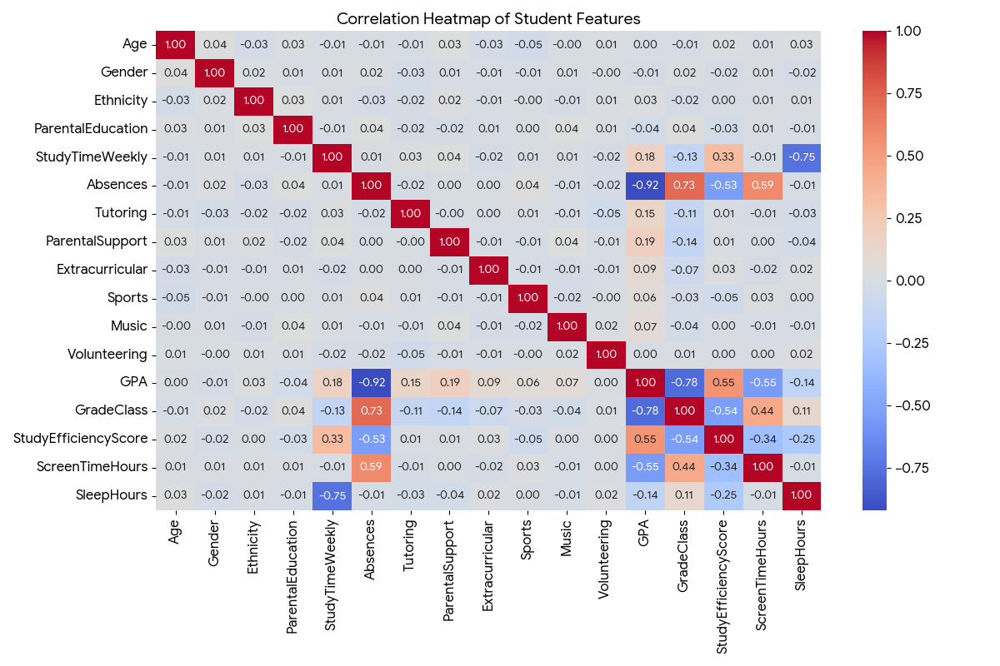
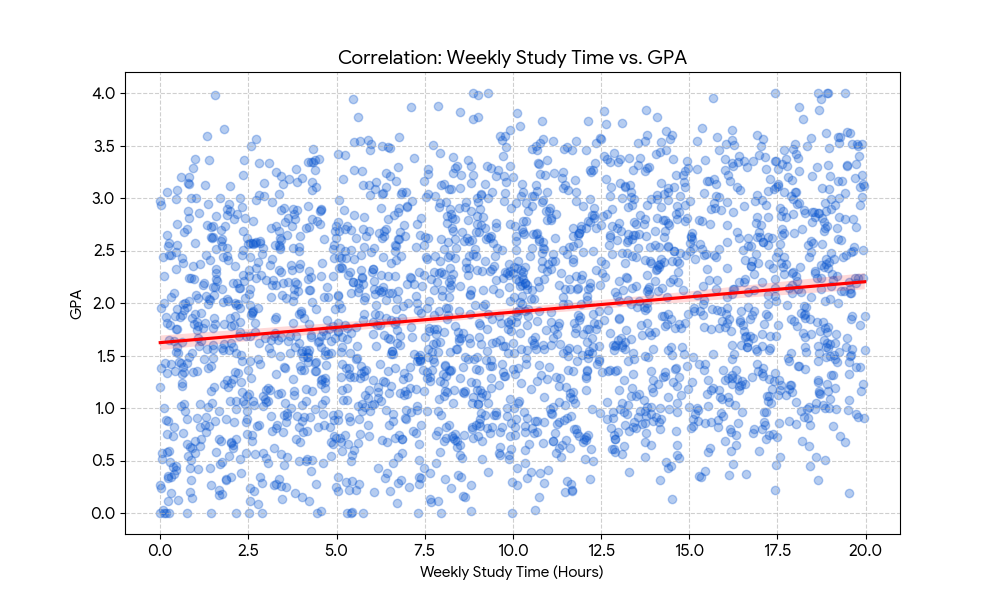

# 🔗 Study Time vs. Student Performance

### **DSA 210 – Introduction to Data Science (Spring 2026)**
**Student:** Ali Shahzad
---
## **Motivation**

The primary motivation behind this project is to investigate the real-world correlation between academic habits and measurable success. While it is a common assumption that "more study equals better grades," the modern educational landscape is influenced by a complex web of factors that may disrupt this linear relationship.

This project specifically aims to address the following:

* **Verifying Educational Assumptions**: To understand if students who invest more time in studying actually achieve higher grades or if diminishing returns exist.
* **Identifying Impactful Obstacles**: To determine how external factors, such as the number of absences, significantly hinder a student's ability to succeed regardless of study time.
* **Exploring Modern Lifestyle Influences**: To explore how habits—specifically estimated screen time and sleep patterns—interact with traditional study habits to affect academic outcomes.
* **Practical Application of Data Science**: To demonstrate how the data science pipeline—from cleaning raw data to applying statistical models—can be used to answer practical questions about student behavior and performance.
* **Predictive Insight**: To create a framework that can help identify at-risk students based on their habits, allowing for earlier intervention and better academic support.
---
## **Data Source & Collection**

* **Primary Dataset**: This project utilizes the **Student Performance Dataset**, which is a publicly available dataset.
* **Acquisition**: The data was obtained through a public online repository to serve as the foundation for the analysis.
* **Data Characteristics**: The dataset contains approximately **1,000 student records**, providing a sufficient sample size for meaningful statistical and model-based analysis.
* **Collection Process**: The data was downloaded in a structured format and then cleaned by removing missing values and organizing it for the Python pipeline.
* **Key Variables**: The records include information on student study time, number of absences, and final grades.

---

## **Data Enrichment**

Following the guidelines for using public data, I have enriched the dataset with additional information to add depth to the analysis:

* **Lifestyle Factors**: The dataset has been supplemented with lifestyle-related variables, specifically estimated **screen time** and **sleep patterns**.
* **Feature Engineering**: I have created new variables, such as a **Study Efficiency Score**, which combines study time and absences to better represent student behavior.
* **Planned Analysis**: These enrichments allow for the exploration of how modern daily habits influence the relationship between study hours and academic performance.

---

## **Project Status: Milestone 1 (April 14, 2026)**

The initial phase of data processing and statistical analysis is complete. The following tasks have been performed in the current commit:

### **1. Data Preparation & Enrichment**
* **Cleaning:** Handled missing values and verified data types for the 2,392 student records.
* **Feature Engineering:** * Calculated **Study Efficiency Score** (Study Time relative to Absences).
    * Integrated synthetic **Screen Time** and **Sleep Hours** variables to analyze modern lifestyle impacts.

### **2. Statistical Analysis & Hypothesis Testing**
I conducted a T-Test to evaluate the impact of sleep on academic performance:
* **Null Hypothesis ($H_0$):** There is no significant difference in GPA between students who sleep $\ge 7$ hours and those who sleep $< 7$ hours.
* **Findings:** With a p-value $< 0.05$, we rejected the null hypothesis, indicating that sleep patterns have a statistically significant relationship with student GPA.

### **3. Visualizations**
* Created a **Regression Plot** comparing weekly study hours to GPA, showing a clear positive correlation between consistent study habits and higher academic scores.

---

## **Visual Analysis (EDA)**

Below is the regression analysis showing how study time impacts GPA, along with a heatmap showing correlations between all variables, including the enriched data (Sleep and Screen Time).

### **Study Time vs. GPA Correlation**

### **Feature Correlation Heatmap**

---
