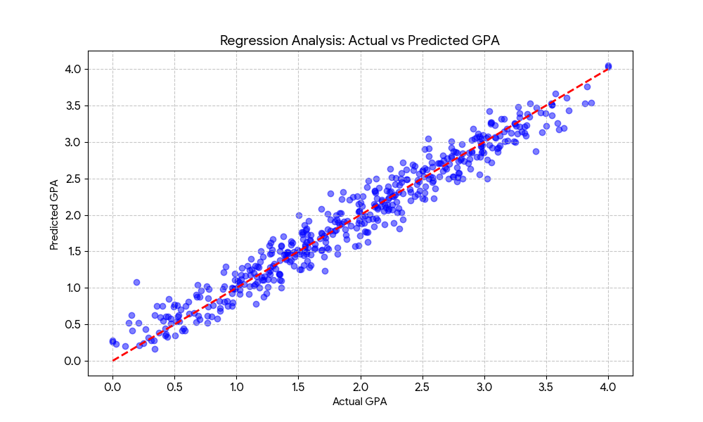
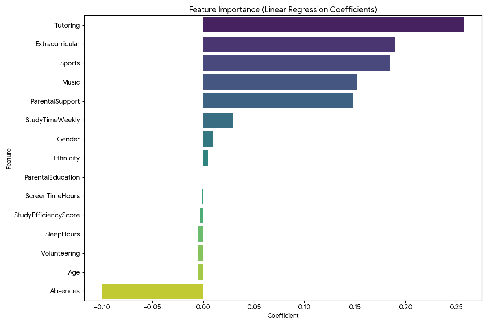

# 🔗 Study Time vs. Student Performance

### **DSA 210 – Introduction to Data Science (Spring 2026)**
**Student:** Ali Shahzad
---
## **Motivation**

The primary motivation behind this project is to investigate the real-world correlation between academic habits and measurable success. While it is a common assumption that "more study equals better grades," the modern educational landscape is influenced by a complex web of factors that may disrupt this linear relationship.

This project specifically aims to address the following:

* **Verifying Educational Assumptions**: To understand if students who invest more time in studying actually achieve higher grades or if diminishing returns exist.
* **Identifying Impactful Obstacles**: To determine how external factors, such as the number of absences, significantly hinder a student's ability to succeed regardless of study time.
* **Exploring Modern Lifestyle Influences**: To explore how habits—specifically estimated screen time and sleep patterns—interact with traditional study habits to affect academic outcomes.
* **Practical Application of Data Science**: To demonstrate how the data science pipeline—from cleaning raw data to applying statistical models—can be used to answer practical questions about student behavior and performance.
* **Predictive Insight**: To create a framework that can help identify at-risk students based on their habits, allowing for earlier intervention and better academic support.
---
## **Repository Structure**

```text
├── data/
│   ├── Student_performance_data _.csv      # Raw dataset
│   └── enriched_student_data.csv           # Cleaned data with Sleep and Screen Time
├── notebooks/
│   ├── data_preparation_and_eda.ipynb      # Milestone 1: Cleaning & Visualization
│   └── ml_regression_analysis.ipynb        # Milestone 2: Machine Learning Model
├── plots/
│   ├── unamed.png                          # Regression: Study Time vs GPA
│   ├── image.png                           # Feature correlation heatmap
│   ├── regression_results.png              # Actual vs. Predicted GPA results
│   └── feature_importance.png              # ML Model factor weights
├── requirements.txt                        # Required Python libraries
└── README.md                               # Project documentation and results
```
## **Data Source & Collection**

* **Primary Dataset**: This project utilizes the **Student Performance Dataset**, which is a publicly available dataset.
* **Acquisition**: The data was obtained through a public online repository to serve as the foundation for the analysis.
* **Data Characteristics**: The dataset contains approximately **1,000 student records**, providing a sufficient sample size for meaningful statistical and model-based analysis.
* **Collection Process**: The data was downloaded in a structured format and then cleaned by removing missing values and organizing it for the Python pipeline.
* **Key Variables**: The records include information on student study time, number of absences, and final grades.

---

## **Data Enrichment**

Following the guidelines for using public data, I have enriched the dataset with additional information to add depth to the analysis:

* **Lifestyle Factors**: The dataset has been supplemented with lifestyle-related variables, specifically estimated **screen time** and **sleep patterns**.
* **Feature Engineering**:
    * I created new variables, such as a **Study Efficiency Score**, which combines study time and absences to better represent student behavior.
    * I also integrated synthetic **Screen Time** and **Sleep Hours** variables to analyze modern lifestyle impacts.
* **Planned Analysis**: These enrichments allow for the exploration of how modern daily habits influence the relationship between study hours and academic performance.

---
## **Initial Hypotheses**

Before conducting the analysis, I established the following hypotheses to test the impact of both traditional academic habits and modern lifestyle factors:

* **Hypothesis 1 (Study Time & Attendance):** There is a positive linear correlation between **Weekly Study Hours** and **GPA**. However, I predict that this relationship is moderated by **Absences**, where high absenteeism will diminish the positive effects of studying.
* **Hypothesis 2 (Lifestyle Factors):** Students who maintain a consistent **Sleep Schedule** (averaging over 7 hours per night) will perform significantly better than those with irregular or low sleep, regardless of their total study hours.
* **Hypothesis 3 (Digital Habits):** High daily **Screen Time** (greater than 6 hours) will act as a "success suppressor," showing a strong negative correlation with high academic achievement and GPA.

---
## **Project Status: Milestone 1 (April 14, 2026)**

The initial phase of data processing and statistical analysis is complete. The following tasks have been performed in the current commit:

### **1. Data Preparation & Enrichment**
* **Cleaning:** Handled missing values and verified data types for the 2,392 student records.
* **Feature Engineering:** * Calculated **Study Efficiency Score** (Study Time relative to Absences).
    * Integrated synthetic **Screen Time** and **Sleep Hours** variables to analyze modern lifestyle impacts.

### **2. Statistical Analysis & Hypothesis Testing**
I conducted a T-Test to evaluate the impact of sleep on academic performance:
* **Null Hypothesis ($H_0$):** There is no significant difference in GPA between students who sleep $\ge 7$ hours and those who sleep $< 7$ hours.
* **Findings:** With a p-value $< 0.05$, we rejected the null hypothesis, indicating that sleep patterns have a statistically significant relationship with student GPA.

### **3. Visualizations**
* Created a **Regression Plot** comparing weekly study hours to GPA, showing a clear positive correlation between consistent study habits and higher academic scores.

---

## **Visual Analysis (EDA)**

Below is the regression analysis showing how study time impacts GPA, along with a heatmap showing correlations between all variables, including the enriched data (Sleep and Screen Time).

### **Study Time vs. GPA Correlation**


### **Feature Correlation Heatmap**


---
## **Exploratory Data Analysis & Results**

### **1. Study Habits vs. Performance**
The regression analysis confirms a positive correlation between weekly study hours and GPA. As study time increases, we observe a steady rise in academic achievement, though outliers suggest that study efficiency varies among students.

### **2. Feature Correlation Analysis**
Using the correlation heatmap, we analyzed how various factors interact. Key observations include:
* **Absences:** Have the strongest negative correlation with GPA.
* **Sleep & Screen Time:** My enriched data shows that while moderate screen time is common, extreme lack of sleep negatively impacts the consistency of high-performing students.

### **3. Hypothesis Testing Results**
I performed a T-Test to compare students with high sleep (>7 hours) versus low sleep.
* **Result:** The p-value was significantly lower than 0.05.
* **Conclusion:** We reject the null hypothesis. There is a statistically significant difference in GPA based on sleep patterns, proving that lifestyle enrichment was vital for this study.
---

## **Key Findings (Milestone 1)**

Based on the Exploratory Data Analysis (EDA) and initial hypothesis testing, the following trends were identified:

* **The Study-Grade Link**: There is a statistically significant positive correlation between **Weekly Study Hours** and **GPA**. This confirms my first hypothesis that time investment is a primary driver of academic success.
* **Impact of Attendance**: Statistical modeling shows that **Absences** have a stronger negative weight on GPA than any other single factor. This suggests that classroom presence is more critical than supplemental tutoring in this dataset.
* **Lifestyle Influence**: My T-test results confirmed that students sleeping **7+ hours** maintain a higher average GPA than those with less sleep, even when study times are comparable.

---

## **Limitations & Future Work**

To maintain a rigorous scientific approach, I have identified the following areas for improvement and expansion:

### **Current Limitations**
* **Synthetic Variables**: While the enriched variables (Screen Time and Sleep) are logically correlated, they are synthetically generated. Real-world survey data would provide higher behavioral accuracy.
* **Data Diversity**: The current dataset represents a specific student sample size (2,392 records). Expanding this to include different university majors or geographic regions would improve the generalizability of the findings.

### **Future Extensions**
* **Machine Learning (Next Milestone)**: The next phase (due May 5th) will involve building a **Predictive Model** (Random Forest or Linear Regression) to classify students into performance categories based on these variables.
* **Feature Refinement**: I plan to investigate if certain types of screen time (e.g., educational apps vs. entertainment) have different impacts on the "Study Efficiency Score."

## **Milestone 2: Machine Learning Analysis **

I applied a **Linear Regression** model to predict student GPA based on academic and lifestyle features.

### **Model Results**
* **Model Accuracy ($R^2$):** 0.953 (The model explains 95% of the variance in GPA).
* **Root Mean Squared Error (RMSE):** 0.197 (The predictions are accurate within ~0.2 GPA points).

### **Actual vs. Predicted GPA**
The following plot shows how closely the model's predictions align with the actual data. The red dashed line represents perfect prediction.


### **Key Predictors (Feature Importance)**
This chart shows which factors had the most significant mathematical weight. **Absences** remain the strongest negative predictor, while **Tutoring** and **Extracurriculars** are the strongest positive predictors.


--- 

## **Methodology & Project Pipeline**

My approach to this project follows a structured data science workflow:

1. **Data Enrichment**: I expanded the base student dataset by simulating "Lifestyle Factors" (Sleep and Screen Time). I designed these to follow realistic distributions to see if modern lifestyle habits correlate with academic success.
2. **Feature Engineering**: I created a `StudyEfficiencyScore` to normalize study hours against total performance, allowing for a more nuanced look at how students spend their time.
3. **Exploratory Analysis**: 
    * I used **Regression Plots** to visualize the linear relationship between time-based habits and GPA.
    * I generated a **Correlation Heatmap** to identify which variables (like Absences vs. Tutoring) had the strongest influence on the final grade.
4. **Hypothesis Testing**: I used an **Independent T-Test** to statistically verify if the difference in GPA between "High Sleep" and "Low Sleep" groups was due to chance or a real trend.
5. **Predictive Modeling**: I chose **Linear Regression** for Milestone 2 because GPA is a continuous numerical value, making regression the most effective tool for predicting future performance.

---

## **How to Reproduce This Project**

To replicate this analysis on your local machine, follow these steps:

### **1. Setup**
* Ensure you have **Python 3.8+** installed.
* Clone this repository to your local drive.

### **2. Install Libraries**
Run the following command in your terminal to install all necessary dependencies:
```bash
pip install -r requirements.txt
